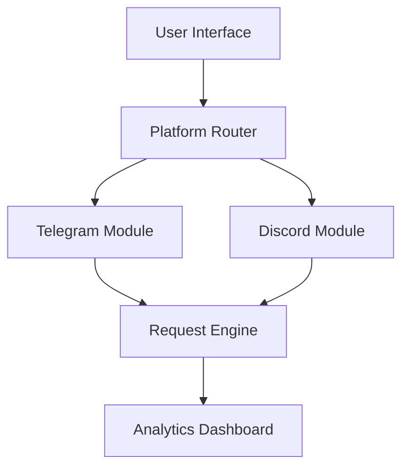

# 💣 VxzSpammer - Multi-Platform Messaging Tool

<div align="center">


**A next-generation web application for cross-platform messaging automation**

[Features](#-features) • [Quick Start](#-quick-start) • [Configuration](#-configuration) • [Disclaimer](#-important-notice)

</div>

## 🎯 Overview - [VxzSpammer](https://vxz-spammer.vercel.app/)

VxzSpammer is a sophisticated web-based messaging platform that enables seamless communication across multiple services from a single, intuitive interface. Built with modern web technologies and featuring an elegant glass-morphism design, it provides enterprise-grade messaging capabilities with real-time analytics.

## ✨ Features

### 🚀 Core Capabilities
- **Multi-Platform Integration** - Unified messaging for Telegram, Discord, and NGL
- **Advanced Scheduling** - Intelligent timing controls and delivery optimization
- **Real-Time Analytics** - Live monitoring with detailed campaign statistics
- **Smart Rate Limiting** - Adaptive messaging to prevent service limitations

### 🔧 Technical Excellence
- **Advanced Spoofing** - Dynamic User-Agent rotation and request customization
- **Modern Architecture** - Built with cutting-edge web technologies
- **Responsive Design** - Flawless experience across all devices
- **Secure Operations** - Client-side processing with no data storage

## 🛠️ Quick Start

### Prerequisites
- 🌐 Modern browser (Chrome 90+, Firefox 88+, Safari 14+)
- 📡 Stable internet connection
- 🔑 Platform credentials (bot tokens, webhook URLs)

### Installation & Usage
```bash
# Clone or download the repository
git clone https://github.com/V3XZz/VxzSpammer

# Navigate to project directory
cd vxzspammer

# Launch application
open index.html
```

### 🎮 Basic Usage
1. **Platform Selection** - Choose your target service
2. **Credential Setup** - Configure API keys and tokens
3. **Message Crafting** - Design your message content
4. **Delivery Settings** - Adjust timing and frequency
5. **Launch Campaign** - Initiate messaging sequence

## ⚙️ Configuration

### Platform-Specific Setup

#### 🤖 Telegram
```javascript
// Bot Token from @BotFather
const TELEGRAM_CONFIG = {
  botToken: 'YOUR_BOT_TOKEN',
  chatId: 'TARGET_CHAT_ID',
  parseMode: 'HTML'
};
```

#### 💬 Discord
```javascript
// Webhook URL from Channel Settings
const DISCORD_CONFIG = {
  webhookUrl: 'YOUR_WEBHOOK_URL',
  username: 'CustomBot',
  avatarUrl: 'OPTIONAL_AVATAR'
};
```


## 📊 Monitoring & Analytics

| Metric | Description | Real-time Display |
|--------|-------------|-------------------|
| **Messages Sent** | Total successful deliveries | ✅ Live Counter |
| **Success Rate** | Delivery success percentage | 📊 Progress Bar |
| **Response Time** | Average platform response | ⏱️ Performance Chart |
| **Errors** | Failed delivery attempts | 🚨 Alert System |

## 🛡️ Important Notice

### ⚠️ Legal & Ethical Usage
> **Critical Compliance Information**
> 
> This tool is designed for **educational purposes and legitimate automation tasks only**. Users are solely responsible for:
> - Obtaining proper authorization for all messaging activities
> - Complying with platform-specific Terms of Service
> - Adhering to applicable local and international laws
> - Respecting recipient privacy and communication preferences

### 🔒 Responsible Usage Guidelines
- ✅ **Allowed**: Personal automation, educational testing, authorized notifications
- ❌ **Prohibited**: Spam, harassment, unauthorized bulk messaging, illegal activities

## 🏗️ Architecture



## 🤝 Contributing

We welcome contributions from the developer community! Here's how you can help:

### 🐛 Reporting Issues
- Use GitHub Issues with detailed descriptions
- Include platform and browser information
- Provide reproducible steps

### 💡 Feature Requests
- Submit well-documented proposals
- Consider implementation complexity
- Assess broader community benefit

### 🔧 Development
1. Fork the repository
2. Create feature branch (`git checkout -b feature/amazing-feature`)
3. Commit changes (`git commit -m 'Add amazing feature'`)
4. Push to branch (`git push origin feature/amazing-feature`)
5. Open Pull Request

## 📄 License

Distributed under MIT License. See `LICENSE` for complete information.

## 📞 Support & Community

- 🐛 **Bug Reports**: [Whatsapp Support](https://wa.me/6285167495079)
- 📧 **Contact**: [Telegram Support](https://t.me/V3XZz)

---

<div align="center">

**⚡ Powered by modern web technologies | 🎨 Beautiful glass-morphism design | 🔒 Secure client-side execution**

*Built with ❤️ for the developer community*

[⬆ Back to top](#-vxzspammer---multi-platform-messaging-tool)

</div>
